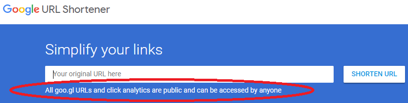
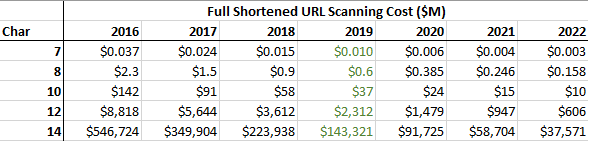

URL Shortener Design Doc
=============
URL shorteners are used to access Internet resources using a short URL that is easily typed and compactly stored.
Well-known shortener examples include:

  * Bitly: the most popular and one of the oldest URL shorteners is used by Twitter for inserting links in tweets.
  By 2016 they had shortened 26 billion URLs
  * TinyURL. A simple shortener that requires no sign-up and allows users to customize the keyword
  * Goo.gl (DISCONTINUED): URL shortener written and retired by Google

## Key Features
Comparing to the leading ULR shortening service, this design has:

  * Higher security (12-character) standard links instead of 7 characters (Bitly standard links), 8 characters (TinyURL links),
    and 10 characters (Bitly Facebook links).
  * Additional (14-character) security for gray-listed sensitive domains (Box,Dropbox, Google Maps, ...)
  * Scalability designed into architecture: Orchestration of large workloads scaling 
  * Database sharding information encoded into shortened URLS.

## Security
The use of URL shorteners can compromise security as reducing entropy of URLs used to specify websites is the purpose
of the function [Shmatikov][Shmatikov-blog]. The address space of shortened URLs can be scanned to find URLs that reveal
confidential customer information. Google has discontinued their URL shortening service, but provide clear warnings
about risks of using the service that they no longer provide.

As a result, the URL shortened address space can be searched to find web sites containing

  * Cloud storage URLs for documents such as Box, Dropbox, GoogleDrive, and OneDrive documents
      represent a <i>huge</i> security issue. For instance OneDrive links not only let adversaries edit
      the document, they can also use this link to gain access to other files [Shmatikov].
  * Map trip description URLs which may include the users identifiable home address linked to destinations.
      By starting from an address and mapping all endpoints, one can create a map of who visited whom [Shmatikov].

URL shorteners should provide shortened URLs that are long enough to make adversarial scanning unattractive,
  limit the scanning of large numbers of potential URLs (by CAPTCHAS and IP blocking),
  and avoid generation of sequential URL addresses.
  
The adversarial cost of scanning the 7-bit standard Bit.ly address space was $37k in 2016 [Shmatikov]. 
The cost of Internet transit dropped 36% per year from 2010-2015 [BandwidthPriceTrends].
Using these two data points, we can project that by 2022 it will be possible to scan
all of a 10-character URL space for around $10M, so even the highest security level
that Bitly offers is not good enough for securing a large number of sensitive URLs.

In contrast, this URL shortening project uses 12 characters for standard
level of security, projected to cost ~$600M to scan in 2022.
Sensitive domains are shorted to 14 characters, where scanning the entire URL space is projected to cost ~$37B in 2022.

In addition, URL shorteners may use sequential codes for the shortened URLs, which further reduces security by
allowing receipts of a shorted URL to access compromised related URLs. Bitly appears to use a 6 character
URL shortening space for addresses shortened at a similar time. If someone finds a sensitive shortened Bitly URL,
they can scan all of the other URLs shorted around the same time for a few hundred dollars [Shmatikov].

## Design
The length of shortened URLs needs to be long enough to provide unique results for every URL shortening request.
The initial design is to support a  traffic load of 200 shortened requests/second, over a period of 5 years.
Seven character shortened URLs are sufficient to meet this initial traffic estimate. For comparison, standard
shortened URLs are 7 characters for standard Bitly links, 8 characters for TinyURL links.

### URL Encoding
In this URL shortening architecture, shortened URLs will be constructed with characters a-z, A-Z, and 0-9, for a total of 62 different characters
(the same character set used by Bitly for shortening).

The system goal of 200 URL shortening request/sec means over a 5 year period the expected number of shortening requests is:

    200 * 60sec * 60min * 24hr * 365day * 5year ~ 32 billion requests

Assuming an overcapacity ratio of 20x to make adversarial scanning of the URL space less attractive,
requires ~3.2 trillion URLs available, which can be encoded using 7 characters (taken from the 62 character set).

### Architecture
Counter-based, pseudo-random sequence for increased security

Scalability needs to be accommodated, and the solution needs to support in-service scaling to higher levels of traffic.
Fixed-length short URLs are implemented, although the length of URLs should be increased over time
as the URL space filled up.

### Encode Architecture

### Decode Architecture

### Caching
Caching is another performance enhancing feature which is important (not included in current algorithm implementation).
A caching system (such as Redis or Memcache) will save responses to recent queries.
When requesting a shortened URL, caching will intercept frequent requests to provide shortened URLs for the same long URL, which in
turn minimizes wasted data storage due to multiple shortened versions of the same URL that would otherwise occur.
Caching also reduces load on the URL database when many users are requesting access to the same shortened URL, by storing common
resent requests in cache.

### Application Containers
Containers have become popular for ensuring consistency between development and release cycles,
and local and cloud-based deployment.

Docker is often used for its benefits of container management, including platform independence
and ease of managing resources. Docker is commonly pairing with many application provisioning system.

AWS AMIs

### Cloud-Based Application Provisioning
This URL shortener is implemented using Terraform for Cloud Worker orchestration, and depolyed in an AWS cloud environment.
Terraform was chosen as a provisioning solution based on being an open source, cloud agnostic provisioning tool.
Terraform uses a declarative method for specifying deployments, which clearly documents existing state of deployed infrastructure.
Declarative provisioning is easier to operate correctly and reliably than using a procedural approach, for example as provided by Chef and Ansible.

### High-Availability Databases
The 

The URL database needs to be fairly high reliability, but cost is also a critical issue.
The volume of writes and reads is high, and the service has free competitors which puts
some limit on customer value.

The key-value database is implemented in a distributed open-source key-value store *etcd*,
which is written in Go, and uses the Raft consensus algorithm. Other distributed key-value
stores include Aerospike, ArandoDB, BoltDB, CouchDB, Google Cloud Datastore, rediisHbase, and Redis.
https://www.g2.com/categories/key-value-stores

### Key-Value Database Sharding
Database access to store the mapping from shortened URLs to URLs can be a
bottleneck for performance, limiting the scalability of popular web-based application.

Database sharding allows the generated data to be split across multiple databases,
reducing the load on each database. Here database sharding is implemented as a key
part of the software architecture. Database sharding, together with using Kubernetes
to scale resources, should allow this URL shortener implementation to scale to high
levels of use.

### System Capacity Scalability
The system design should be scalable to handle more success than budgeted.
A successful URL shortening project could result in far more than 200 shortening requests per second.
Successful operation of the project would result in more than 5 years of operation.
As a result, in-service expansion of capability is highly desirable.

In the case of higher than expected demand, the URL encoding function should be upgraded to add additional
characters (from 7 to 8-10 characters). In the case of system capacity expansion,
the URL decoding software will chose which generation of URL encoding schema to apply.
Each time system capacity is increased by increasing number of characters,
there also will be an option to increase the number of database shards.

### Grey-Listing Sensitive URLs
Sensitive URLs like Dropbox URLs or Maps URLs should not be shortened like URLs suitable for public access.
Here URLs from these sensitive domains are gray-listed for special processing, initially shortened to 12 characters
(for an address space of 3x10^21) rather than the initial 7 character shortened addresses.
Scanning a 12-character address space should increase the full scanning cost from $37k to $34B (in 2016 prices),
which would seem to be sufficiently high to make URL scanning unattractive compared to exploiting vulnerabilities
in other URL shorting services.

## Implementation

## Performance Results

## Future Features
So far this Minimum Viable Product (MVP) is designed to demonstrate highly scalable link shortening.
A variety of other features would be necessary to make this a commercially viable product.

<b>Branded domains</b>: Support link shortening for user-customized domain names.

<b>Monetization</b>: As and example, Bitly limits free user to 10k clicks/month, and only 500 clicks/month with a branded domain.
  Their business plan is available for $950 per month.
  Bitly is eying revenue of $100M/year, suggesting a market demand of around 100k professional licenses [BitlyRevenue]

## References

[Shmatikov]: [Gone in Six Characters: Short URLs Considered Harmful for Cloud Services](https://arxiv.org/pdf/1604.02734v1.pdf)

[Shmatikov-blog]: [(blog post) Gone In Six Characters: Short URLs Considered Harmful...](https://freedom-to-tinker.com/2016/04/14/gone-in-six-characters-short-urls-considered-harmful-for-cloud-services/)

[BandwidthPriceTrends]: [Internet transit pricing](http://drpeering.net/white-papers/Internet-Transit-Pricing-Historical-And-Projected.php)

[FeatureComparison]: [Bit.ly vs TinyURL](https://www.slant.co/versus/2591/22693/~bitly_vs_tinyurl)

[BitlyRevenue] https://www.cnbc.com/2016/05/26/web-link-shortening-company-bitly-eyeing-100m-revenues.html]