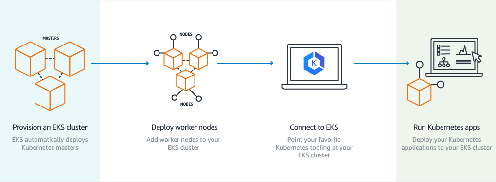

<!--- to sync code snippets, use $ embedmd -w README.md ---> 

URL Shortener Design Doc
=============
Uniform Record Locator (URL) shorteners are used to access Internet resources, by providing a short URL to a resource that is easily typed and compactly stored.
Well-known URL shorteners include:

  * Bitly: the most popular and one of the oldest URL shorteners is used by Twitter for inserting links in tweets.
  By 2016 they had shortened 26 billion URLs
  * TinyURL. A simple shortener that requires no sign-up and allows users to customize the keyword
  * Goo.gl: URL shortener (DISCONTINUED SERVICE) written and
     [shut down](https://developers.googleblog.com/2018/03/transitioning-google-url-shortener.html) by Google

Most URL shortener use is free, but projections for Bitly revenue is in the
  [range of $100M](https://www.cnbc.com/2016/05/26/web-link-shortening-company-bitly-eyeing-100m-revenues.html),
  achieved by a freemium model with [paid Enterprise features](https://www.slant.co/versus/2591/22693/~bitly_vs_tinyurl).


## Key Features
In contrast to the leading ULR shortening service, the features of this design include:

  * Higher security (12-character) standard links instead of 7 characters (Bitly standard links), 8 characters (TinyURL links),
    or 10 characters (Bitly Facebook links).
  * Additional (14-character) security needed for gray-listed sensitive domains (Box, Dropbox, Google Maps, ...)
  * Scalability designed into architecture: Cloud-based worker system design, with orchestration for automatic scaling
  * Database sharding information encoded into shortened URLS for additional scalability


## User Security
The use of URL shorteners can compromise security as the purpose of URL shorteners is to
[reduce entropy of URLs](https://freedom-to-tinker.com/2016/04/14/gone-in-six-characters-short-urls-considered-harmful-for-cloud-services/)
used to specify websites.

The address space of shortened URLs can be scanned by adversaries to find URLs that reveal confidential customer information.
Perhaps because of these security issues, Google has discontinued their URL shortening service, but maintain service
to expand previously shortened URLs and provide clear warnings about risks of using the service even though they no longer provide it.
The other major URL shortening services which continue to operate do not provide warnings about security issues
in using URL shorteners.

<div style="margin-left: 150px"></div>

As a result of reduced URL shortened address space, possible URL shortened addresses can be scanned to find web sites containing:

  * Cloud storage URLs for documents such as Box, Dropbox, GoogleDrive, and OneDrive documents.
      This is a <i>huge</i> security issue. For instance, OneDrive links not only let adversaries edit
      the document, they can also use this link to [gain access to other files](https://arxiv.org/pdf/1604.02734v1.pdf).
  * Map trip description URLs which may include the users identifiable home address linked to destinations.
      By starting from an address and mapping all endpoints from multiple URLs, one can create a
      personal connection graph by [determining who visited whom](https://arxiv.org/pdf/1604.02734v1.pdf).

URL shorteners should provide shortened versions that are long enough to make adversarial scanning unattractive,
  limit the scanning of large numbers of potential URLs (by CAPTCHAS and IP blocking),
  and avoid generation of sequential URL addresses.
  
The cost of adversarial [scanning the standard 7-bit Bit.ly address space](https://arxiv.org/pdf/1604.02734v1.pdf)
was $37k in 2016. The cost of Internet transit [dropped 36% per year from 2010-2015](http://drpeering.net/white-papers/Internet-Transit-Pricing-Historical-And-Projected.php)

Using these two data points, we can project that by 2022 it will be possible to scan
all of a 10-character URL space for around $10M, so even the highest security level
that Bitly offers is not good enough for securing the large number of sensitive URLs
that are using Bitly to provide URL shortening.


In contrast, this URL shortening project uses 12 characters for the standard baseline
security level, which is projected to cost ~$600M for a full scan in 2022.
In addition, this project provides shortened URLs for sensitive domains use 14-character addresses,
where scanning the entire URL space is projected to cost ~$37B in 2022.

Another security vulnerability is that URL shortening services may use sequential codes for the shortened URLs,
which further reduces security by allowing recipients of a shorted URL to access compromised related URLs.
Bitly appears to use a 6-character URL shortening space for addresses shortened at a similar time.
If someone finds a sensitive shortened Bitly URL, they can scan all of the other URLs shortened around the same time for a
  [few hundred dollars](https://arxiv.org/pdf/1604.02734v1.pdf).


## URL Encoding
The length of shortened URLs needs to be long enough to provide unique results for every URL shortening request.
In this URL shortening architecture, shortened URLs will be constructed with characters a-z, A-Z, and 0-9,
for a total of 62 different characters (the same character set used by Bitly for short URLs).
As mentioned about, standard URL shortening provides 12-character URLs.

### Grey-Listing Sensitive URLs
Sensitive URLs like Dropbox URLs or Maps URLs should not be as short as URLs suitable for public access.
In this application, URLs from these sensitive domains are gray listed for special processing, initially shortened to 12 characters
(for an address space of 3 x 10^21) rather than 10-character addresses for less sensitive URLs.

Scanning a 12-character address space should increase the cost for a full scan from $37k to $34B (in 2016 prices),
which would seem to be sufficiently expensive to make URL scanning unattractive compared to exploiting vulnerabilities
in competing URL shorting services which are less well protected.

### Database Shard Encoding
Database sharding, where separate databases are used to encode different data, makes scaling of distributed databases more efficient.
In this project, a database shard is assigned to each shortened URL, allowing the expanded URL to be recovered
by querying a smaller database than the size that would be required without sharding.

### Address Range Server / Database
The initial implementation here uses shortening servers which provide URL shortening, and an address range server to provide each shortening
server with unique sets of addresses. Shortened URLs within this address range are served in random order.

As mentioned before, using address ranges is a potential security issue, allowing someone with a shortened URL to one of your resources
to more easily find other related resources shortened at a similar time. This security issue is mitigated here as different shortener
servers have different address ranges, and subsequent shortening requests will likely have completely unrelated addresses.
However, further work would be needed to deploy a commercial URL shortening system without any detectable correlation between addresses.

In order to allow distributed cloud instances to assign unique shortened URLs, a server is used to allocate encoded address
ranges to each instance. This address range server needs to be highly reliable in order to avoid assigning the same shortened URL codes
to multiple long URLs. Here a centralized server is used to generate small address ranges and assign them to 

A highly reliable distributed datastore such as [Zookeeper](https://aphyr.com/posts/291-call-me-maybe-zookeeper)
would be a better choice for this address range server task. Zookeeper uses majority quorums - using five notes,
any two nodes could fail without degrading the system. Zookeeper is also linearizable - all clients see the same ordering
for updates occurring in the same order.

### URL Database Sharding / Replicas
Database access to store the mapping from shortened URLs to full URLs can be a
bottleneck for performance, limiting the scalability of popular web-based application.

Database sharding allows the generated data to be split across multiple databases,
reducing the traffic load on each database. Here database sharding is implemented as a key
part of the software architecture. Database sharding, together with scalable cloud workers
to scale resources, should allow this URL shortener project to scale to levels of use
similar to commercial competitors (Bit.ly and others)

[Database read replicas](https://aws.amazon.com/rds/details/read-replicas/) are useful for read-heavy applications
such as this. A URL shortening application is an ideal case for this technology, where database reads and writes
come from separate applications.


## Initial Implementation
A scalable URL shortening algorithm was implemented and deployed, using three AWS server instances for
the URL shortening server, URL expanding server, and internal address server. Two URL databases were deployed
to test database sharding, with an additional database used for the internal address server.

All of the server instances and databases in this demonstration were deployed to a default AWS public subnet,
which allowed easy external access to all of the deployed instances for testing.

Go channels are used as buffers from the address server to the shortener servers,
in order account for data transmission errors which are more likely to occur in network applications.


### AWS Cloud Platform
Amazon Web Services (AWS) was chosen for the initial implementation, as Amazon has over half the
cloud computing provider market share, and as a result has the most mature software solutions.
However, there are many other cloud computing choices. Azure (Microsoft) and Google Cloud Compute
are the next most popular cloud computing providers.

### Amazon Machine Images
AWS uses Amazon Machine Images (AMIs) to customize and manage cloud instances.
The Amazon drawing below shows the lifecycle of an AWS AMI.
AMIs can be created and stored, then registered when ready for instantiation.
Multiple identical cloud instances can be generated from an AMI.
AMIs can be deregistered when no longer needed to free up storage.
AWS provides generic AMIs as a starting point for customization, such as the
  [Linux 2 AMI](https://docs.aws.amazon.com/AWSEC2/latest/UserGuide/finding-an-ami.html).

The [AMI lifecycle](https://docs.aws.amazon.com/AWSEC2/latest/UserGuide/AMIs.html) is:


AMIs can be tagged for identification, such as 'owner', 'development/production', or 'release number'.
Tags can help organize your AWS bill, for example for budgeting and accounting purposes.

AWS provides a [checklist](docs.aws.amazon.com/marketplace/latest/userguide/best-practices-for-building-your-amis.html) for AMIs, including:

    Linux-based AMIs that a valid SSH port is open (default is 22)
    ...
    
### Infrastructure as Code
Cloud computing resources can be configured through a graphical user interface (GUI), but this process is error-prone,
and produces results that cannot always be repeated. It is far better to specify cloud resources with code,
which allows for version control, releases, version rollback, and many other features.

Containers have become a popular for server configuration, ensuring consistency between development and release cycles,
and between local testing and cloud-based deployment. Docker is a container solution often used to provide platform independence
and ease of managing resources.

The server software for this project consists of a single Go binary per instance. The Go language packages all dependencies
into a single executable, and seems like an adequate solution for this URL shortening application without adding
support for production containers.

### Packer
[Packer](https://www.packer.io/) is used in this project for generating the AWS cloud instance images.
AMIs can be configured manually, for example by launching a generic AMI, customizing from the command line,
  then save updated the updated AIM with a new name. However, it would be much better to configure AWS AMIs
as code for the reasons listed above (e.g. documentation and repeatability).

Packer (like Docker) allows building a single configuration management supporting multiple target platforms,
with support for cloud environments such as AWS, Azure, Google Cloud, as well as
desktop environments such as Linux, Windows, and Macintosh environments.
Packer also integrates with software platforms such as Docker, Kubernetes, and VMware.

For complex configurations, Packer interfaces with popular configuration management tools such as 
Chef and Ansible. In this example, each instance is running a single Go binary.
This server application is put in the `scripts/per-boot` folder, so that it runs
on startup, and after any reboot of the AWS instance.

```Packer
{
    ...
    "builders": [{
	"type": "amazon-ebs",
	"access_key": "{{user `aws_access_key`}}",
	"secret_key": "{{user `aws_secret_key`}}",
	"region": "us-west-1",
	"source_ami_filter": {
	    "filters": {
		"virtualization-type": "hvm",
		"name": "amzn2-ami-hvm-2.0.*-x86_64-gp2",
		"root-device-type": "ebs"
	    },
	    "owners": ["137112412989"],
	    "most_recent": true
	},
	"instance_type": "t2.micro",
	"ssh_username": "ec2-user",
	"ami_name": "ami-addr {{timestamp}}"
    }],
      "provisioners": [
    {
      "type": "file",
      "source": "../ReqAddr",
      "destination": "/tmp/ReqAddr"
    },
    {	  
      "type": "shell",
      "inline": [
        "sudo chmod 700 /tmp/ReqAddr",
        "sudo mv /tmp/ReqAddr /var/lib/cloud/scripts/per-boot/",
        "sleep 30",
        "sudo yum -y update"
      ]
    }]
}
```

T2.micro instances are used for development, as they are covered by the
[AWS free tier](https://aws.amazon.com/free/?all-free-tier.sort-by=item.additionalFields.SortRank&all-free-tier.sort-order=asc),
which provides 750 hours of small instance use per month for a year.


### Terraform
Terraform is open-source cloud resource infrastructure deployment software.
It was chosen for this project based on its popularity, and its support of major cloud platforms.

Terraform uses a declarative method for specifying deployments, which documents
existing state of deployed infrastructure, providing the advantages of infrastructure as code discussed earlier.
Declarative provisioning used by Terraform is easier to operate correctly and reliably
than by using a procedural programming approach, for example as provided by Chef and Ansible.

Terraform is programmed using functions directly mapped from the particular cloud vendor modules,
and as a result, its provisioning code is not portable across cloud hardware vendors.
[Amazon CloudFormation](https://aws.amazon.com/cloudformation/) would also have been a reasonable choice
for configuring AWS-specific solution infrastructure, but Terraform does have a lot of features that
are portable across vendor platforms.

The open source Terraform version stores infrastructure configuration in a file on the user's computer,
which is unsuitable for team use as more than one team member might be making configuration changes at
the same time. In addition, the Terraform state file can contain sensitive encryption key information, and
so should not be put into a version control system. With small teams, Terraform can be used by putting the
infrastructure state file in shared, encrypted storage, and adding file locking to avoid simultaneous changes.

[Terraform Cloud](https://www.hashicorp.com/products/terraform/offerings) provides additional team functions for free,
including allowing remote infrastructure state access and locking during Terraform operations.
In addition, Terraform Cloud provides a user interface with history of changes to state, as well as information about who made
infrastructure state changes.

[Terraform Enterprise](https://www.hashicorp.com/products/terraform/offerings) is a paid product providing additional
features, including operations features such as team management and a configuration designer tool,
and governance features such as audit logging. Terraform Enterprise is strongly recommended for large teams
managing infrastructure with Terraform.

### AWS Infrastructure
Terraform uses a 'provider' to specify where/how to deploy the specified resources.
Here the region is specified in a variable 'aws_region'.
Values for all of the variables can be specified in a `*.tfvars` file,
  which allows easy support of multiple regions from the same vendor.
```terraform
// terraform/aws_provider.tf
provider "aws" {
  profile = "default"
  region = "${var.aws_region}"
  version = "~> 2.20"
}

resource "aws_key_pair" "auth" {
  key_name   = "${var.key_name}"
  public_key = "${file(var.public_key_path)}"
}

resource "aws_security_group" "instance" {
  name = "terraform-example-instance"

  // SSH access from anywhere
  ingress {
    from_port   = 22
    to_port     = 22
    protocol    = "tcp"
    cidr_blocks = ["0.0.0.0/0"]
  }
  // other ports
  ...
```

### Address and URL Servers
Aws_instances are defined for each of the address, shortening, and expanding servicer instance.
As mentioned, small `t2.micro` AWS instances are used to minimize cost during development.

```terraform
resource "aws_instance" "addr_server" {
  ami = "${lookup(var.amis_addr, var.aws_region)}"
  instance_type = "t2.micro"
  key_name = "${var.key_name}"
  vpc_security_group_ids = [aws_security_group.instance.id]
```

### Address and URL Databases
For convenience, so far project uses databases implemented using AWS RDS PostgreSql,
which is supported by Terraform.

```terraform
resource "aws_db_instance" "db_shard0" {
  name                    = "db_shard0"
  allocated_storage       = 20 # GB
  engine                  = "postgres"
  instance_class          = "db.t2.micro"
  password = "${var.db_password}"
  port                    = 5433
  publicly_accessible     = true
  skip_final_snapshot     = true
  storage_type            = "gp2"
  username = "postgres"
  vpc_security_group_ids   = ["${aws_security_group.db.id}"]
```

## Next Generation Architecture
The next steps for this project are to move the databases from a public to a private subnet,
set up a network address translation server to allow internet access from the private subnet,
implement load balancers with multiple URL shorten and expand servers,
configure autoscaling for these servers to allow for variable traffic load,
and to set up continuous integration (CI) for development.

Further scaling work could include implementing a caching interface, setting up server groups in multiple geographic zones,
utilizing lower cost AWS spot instances, and investigating less expensive database storage options.


### Private Subnet
A private subnet is used to isolate functions that do not need public access,
in this case the address and URL databases, and potentially to isolate the address server as well.

Amazon AWS provides an example of using AWS modules to implement a
  [network with public and private subnets](https://docs.aws.amazon.com/vpc/latest/userguide/VPC_Scenario2.html).

<div style="margin-left: 150px"></div>

The private network Terraform configuration includes defining the AWS subnet, route table, 
routing table association, and one or more private network security groups.

Classless inter-domain routing (CIDR) blocks are used to define
  [IP address ranges](https://docs.aws.amazon.com/vpc/latest/userguide/VPC_Subnets.html)
allowed for internal connections.


```terraform
resource "aws_subnet" "private" {
  vpc_id = "${aws_vpc.default.id}"
  cidr_block = "${var.private_cidr}"
  availability_zone = "us-west-1"
}

resource "aws_route_table" "private" {
  vpc_id = "${aws_vpc.default.id}"
  route {
    cidr_block = "0.0.0.0/0"
    instance_id = "${aws_instance.nat.id}"
  }
}

resource "aws_route_table_association" "private" {
  subnet_id = "${aws_subnet.private.id}"
  route_table_id = "${aws_route_table.private.id}"
}

resource "aws_security_group" "db" {
  vpc_id = "${aws_vpc.default.id}"
  ingress {
    from_port = 22
    to_port = 22
    protocol = "tcp"
    cidr_blocks = ["${var.private_cidr}"]
  }
  ...
```

### NAT server
A network address translation (NAT) function is needed to provide access to the internet from
modules on the private subnet. 

Amazon provides pre-built AMIs for implementing a cloud instance configured as a NAT server.

```terraform
resource "aws_security_group" "nat" {
  name = "vpc_nat"
  description = "Allow traffic to pass from the private subnet to the internet"
  ingress {
    from_port = 22
    to_port = 22
    protocol = "tcp"
    cidr_blocks = ["0.0.0.0/0"]
  }
  ...
  
```

### Load Balancer
Two load balancers are needed to share traffic load to the short serves and expand servers.
AWS [elastic load balancing](https://aws.amazon.com/elasticloadbalancing/) (ELB) modules will be used here
for load balancing. There are a variety of other load balancing solutions that could be used,
including setting up an Nginx server at the front-end.

```terraform
resource "aws_elb" "url" {
  name               = "foobar-terraform-elb"
  availability_zones =["${var.aws_region}"]

  access_logs {
    // bucket        = "foo"
    bucket_prefix = "url"
    interval      = 60
  }

  listener {
    instance_port     = "${var.port_internal}"
    instance_protocol = "http"
    lb_port           = 80
    lb_protocol       = "http"
  }

  listener {
    instance_port      = "${var.port_internal}"
    instance_protocol  = "http"
    lb_port            = 443
    lb_protocol        = "https"
    ssl_certificate_id = "arn:aws:iam::**TBD**:server-certificate/certName"
  }

  health_check {
    healthy_threshold   = 2
    unhealthy_threshold = 2
    timeout             = 4
    target              = "HTTP:" + "${var.port_internal}"
    interval            = 25
  }

  instances                   = ["${aws_instance.url.id}"]
  cross_zone_load_balancing   = true
  idle_timeout                = 500
  connection_draining         = true
  connection_draining_timeout = 500

  tags = {
    Name = "url_elb"
  }
}
...
```

### Server autoscaling
A major advantage of cloud deployments is the ability to allocate resources on demand,
without paying for peak capability all of the time.

Amazon offers an autoscaling [autoscaling](https://www.terraform.io/docs/providers/aws/r/launch_configuration.html)
  group function which Terraform can configure.
  
```terraform
resource "aws_launch_configuration" "url" {
  image_id        = "ami-0c55b159cbfafe1f0"
  instance_type   = "t2.micro"
  security_groups = [aws_security_group.instance.id]

  lifecycle {
    create_before_destroy = true
  }
}

resource "aws_autoscaling_group" "auto" {
  name                 = "url_autoscaling_group"
  launch_configuration = "${aws_launch_configuration.url}"
  min_size             = 1
  max_size             = 8

  lifecycle {
    create_before_destroy = true
  }
}
...
```


### Bastion Host
The architecture used here has a public-facing load-balancer, which forwards traffic to compute instances for serving shortened or expanded URLs.
Network security can be improved significantly by providing a single network entry point, known as a bastion host, for network control and monitoring.
Users can log in to the network using an SSH agent configured with agent forwarding from the client computer to avoid having to
  [store the private key on the bastion computer](https://aws.amazon.com/blogs/security/securely-connect-to-linux-instances-running-in-a-private-amazon-vpc/)

For maximum security, the bastion host can be configured as a stand-alone server providing only network access and traffic forwarding,
using a stripped-down operating system such as
  [AWS AppStream](https://aws.amazon.com/blogs/security/how-to-use-amazon-appstream-2-0-to-reduce-your-bastion-host-attack-surface/).

### Caching
Caching is another performance enhancing feature which is important feature to be implemented.
A caching system (such as Redis or Memcache) will save responses to recent queries.
When requesting a shortened URL, caching will intercept frequent requests to provide shortened URLs for the same long URL,
which in turn minimizes wasted data storage due to multiple shortened versions of the same URL that would otherwise occur.
Caching also reduces load on the URL database when many users are requesting access to the same shortened URL,
by storing common resent requests in cache.

### AWS Spot Instances
Cloud vendors such as AWS have reserved instances which can be held and operated indefinitely.
Vendors also offer much less expensive spot instances, which are priced on an instantaneous
'spot price' model, and can be preempted whenever someone bids a higher price for them.

When using spot instances to handle traffic overflow, enough reserved instances should still be
maintained at a baseline level to ensure meeting service level availability objectives.
In addition, account limits on the maximum number of spot instances should be checked to verify
maximum capacity under heavy traffic.

Spot instances will be preempted frequently, so they need to handle a termination command (`shutdown -h`)
promptly and reliably. Switching from reserved instances to spot instances needs to be
[performed carefully](https://www.honeycomb.io/blog/treading-in-haunted-graveyards/) to avoid
introducing instance allocation issues.

### Continuous Integration
Continuous integration (CI) and continuous deliver (CD) are important for teams delivering high quality software.
AWS [CodeBuild](https://aws.amazon.com/codebuild/) and CodeDeploy provides CI/CD from GitHub code
to AWS EC2 server instances. [CircleCI](https://circleci.com/) is a very popular open-source CI/CD solution.

[Github Matrix](https://github.com/features/actions?utm_campaign=1565284208) lets you test on Linux, MacOS, Windows, containers, as well as multiple runtime versions,(see Concourse CI). simultaneously.

<div style="margin-left: 150px"></div>

### Database alternatives
A commercially successful URL shortener service has existing competition offering free URL shortening,
which puts some limit on value can be extracted from the customer base.

A free URL shortening service is probably necessary, as it acts as advertising for enterprise customers,
and most users will become familiar with the service when copy/pasting in shortened links provided by others.
A URL shortener without a free tier probably could not compete successfully with successful services,
which to provide free use to most customer.

The data storage requirements are large even for a moderately successful player in this space.
For the modest example goal of 200 URL shortening request/sec would result over a 5-year period in

    200 * 60sec * 60min * 24hr * 365day * 5year ~ 32 billion shortening requests

The URL database needs to be reliable, but cost is a dominant issue.
The volume of database writes and reads is high, so operational costs are high.

Most SaaS applications have very good gross margins, and the cost of using a managed database
is a good tradeoff. However, a managed database like AWS RDS might not be commercially feasible
for this application, in which it should be difficult to maintain high gross margin.

The required URL mapping could be implemented in a distributed key-value database managed by internal staff.
Popular [distributed database](https://www.g2.com/categories/key-value-stores)
  candidates include Aerospike, ArandoDB, BoltDB, CouchDB, Google Cloud Datastore, Hbase, and Redis.
A promising distributed database written in Go is the open source *etcd* database, 
which uses the Raft consensus algorithm.


# Infrastructure Orchestration
Orchestration functions include
* Load-balance groups of containers to handle high levels of traffic
* Scheduling containers to run based on load and available resources
* Implement access policies for applications running inside containers


Terraform was used here for provisioning cloud resources due to its simplicity and ease of use.
Schedulers popular for large and complex systems include Docker Swarm, Fleet, Kubernetes, Marathon, [Mesos](http://mesos.apache.org/), and [Nomad](https://www.nomadproject.io/).
In addition, [Amazon ACS](https://aws.amazon.com/ecs/) and [Microsoft ACI](https://azure.microsoft.com/en-us/services/container-instances/)
are vendor-specific orchestration solutions.

## Kubernetes
Kubernetes provides deployment, scaling, load balancing, and monitoring.
Kubernetes was developed at Google and has become an extremely popular recently due to its power and flexibility.
In 2015, container survey found just 10 percent of respondents were using any container orchestration tool.
Two years later, 71% of respondents were
  [using Kubernetes to manage their containers](https://techcrunch.com/2017/12/18/as-kubernetes-surged-in-popularity-in-2017-it-created-a-vibrant-ecosystem/).

Kubernetes provides
*Scaling
  Can scale containers automatically based on CPU utilization
*Recovery
  Kills and restarts unresponsive containers, while rerouting traffic to functioning containers.
*Load balancing
*Service discovery
*Automatic rollouts
*Secret management

Kubernetes is particularly well suited for a hybrid server use case, for example where some of the resources
  are in an on-prem data center, and other resources are in the cloud.

### Etcd
[Etcd](https://etcd.io) is a distributed key-value store used for the most critical data in a distributed system.
[A Closer Look at Etcd: The Brain of a Kubernetes Cluster](https://medium.com/better-programming/a-closer-look-at-etcd-the-brain-of-a-kubernetes-cluster-788c8ea759a5)

    !fig: etcd on the Kubernetes master nodes (Kubernetes documentation)
    !fig: etcd deployed to an external cluster (Kubernetes documentation)

### Pod Creation
The nice Heptio Kubernetes article "[Jazz Improv over Orchestration](https://blog.heptio.com/core-kubernetes-jazz-improv-over-orchestration-a7903ea92ca)" 
  shows a sequence diagram illustrating an API for scheduling a pod.
<div style="margin-left: 150px"></div>

### Manual Kubernetes Deployment
One way to understand some of the internals of the Kubernetes infrastructure is to type all of the deployment commands manually,
which Kelsey Hightower has set up as [the Hard Way](https://github.com/kelseyhightower/kubernetes-the-hard-way/blob/master/docs/02-client-tools.md) for GKE and AWS.
As a demonstration, I ported some of the CLI commands to [Terraform and Packer](https://github.com/helkey/kubernetes-terraform-way)
using slawekzachcial's [AWS fork](https://github.com/slawekzachcial/kubernetes-the-hard-way-aws) (as Kelsey dropped AWS support from his project).

## Kubernetes Management
Managed services offer ***. [Managed Kubernetes services](https://blog.codeship.com/a-roundup-of-managed-kubernetes-platforms/)
include Google, Azure, Amazon, and [Digital Ocean](https://www.digitalocean.com/products/kubernetes/).

There are also many options for software to manage Kubernetes on the major cloud providers, such as 
  [OpenShift](), [VMWare](), [Stackpoint](), and [AppsCode]().

### Cloud Cost Comparison
Many software services have good margins, but for many companies the cost of deploying servers is still a significant portion of business expense.
Digital Ocean has a [price comparison]() page for comparing their cloud services to Amazon, Google, and Microsoft.

[Kubernetes Opex Analytics]() is an open-source that can be used for
  [Cost Allocation and Capacity Planning Analytics](https://medium.com/@rodrigue.chakode/kubernetes-resource-usage-analytics-for-cost-allocation-and-capacity-planning-416800e85d16)
where you can get started in less than 5 minutes.

Rodrigue Chakode has used Kubernetes Opex Analytics to collect
[this data](https://medium.com/@rodrigue.chakode/kubernetes-resource-usage-analytics-for-cost-allocation-and-capacity-planning-416800e85d16)
breaking down usage per month per namespace, allowing operations teams to focus their cost-saving effort on the most expensive components.
<div style="margin-left: 150px"></div>

Digital Ocean has a pricing page that allows comparison of Amazon AWS, Google, and Microsoft cloud hardware, comparing cost of CPU, storage, and transfer bandwidth.
This can be used to compare cloud host solutions, where the lowest price depends significantly on whether the applicaton is CPU, storage, or transfer bandwidth limited.

<div style="margin-left: 150px">
  
  
  
</div>

This Digital Ocean price comparison apparently uses the cost of reserved instances. Hosting costs can be reduced significantly
by using a mix of reserved and low-price spot instances, but this requires additional engineering effort to set this up.

### Google
Google has the most polished managed Kubernetes service (which comes as no surprise, as Kubernetes was developed at Google).
<!--- id=18080390: GKE only 'decent' k8s implementation, EKS and AKS are not real contenders --->

Tools like Hashicorp Packer somewhat reduce the effort of supporting multiple cloud vendors by providing common tooling across platforms.
Here Packer will be used to build [Google Compute Engine images] for deploying to Kubernetes on GKE. Packer can also be integrated
into a continuous integration workflow, for instance using [Jenkins](https://cloud.google.com/solutions/automated-build-images-with-jenkins-kubernetes).

The first step is to set up a [Google services account file](https://www.packer.io/docs/builders/googlecompute.html).
This services account file is not required if running the Packer builder from a properly configured GCE instance.
Here is an example of building the URL shortener address server using a Packer file.

Install the [Google Cloud SDK](https://cloud.google.com/sdk/docs/) on Ubuntu/WSL:
```sh
echo "deb [signed-by=/usr/share/keyrings/cloud.google.gpg] https://packages.cloud.google.com/apt cloud-sdk main" | sudo tee -a /etc/apt/sources.list.d/google-cloud-sdk.list
sudo apt-get update && sudo apt-get install google-cloud-sdk
curl https://packages.cloud.google.com/apt/doc/apt-key.gpg | sudo apt-key --keyring /usr/share/keyrings/cloud.google.gpg add -
sudo apt-get update && sudo apt-get install google-cloud-sdk
sudo apt-get install google-cloud-sdk-app-engine-go
gcloud init
```

then follow the instructions to log in to the gcloud CLI, set [default region/zone](https://cloud.google.com/compute/docs/gcloud-compute/)
and [cloud storage defaults](https://cloud.google.com/storage/docs/gsutil/commands/config). This will probably require
[billing to be enabled](https://cloud.google.com/billing/docs/how-to/modify-project), but presently Google offers a $300
credit for the first year of use.
```sh
gcloud compute project-info add-metadata \
    --metadata google-compute-default-region=europe-west1,google-compute-default-zone=europe-west1-b
```

Select a project to use from the [GCP Cloud Resource Manager](https://console.cloud.google.com/cloud-resource-manager), and a Linux source image.
Here we will use a CentOS (or Red Hat) image for compatibility with the AWS Linux2 images, and Packer to customize the images.

Set up a Google cloud [service account key](https://www.packer.io/docs/builders/googlecompute.html), and download as a .json file into the default gcloud directory (~/.config/gcloud/).

### Azure
Kubernetes on Azure can be deployed [from a command line interface](https://dev.to/azure/kubernetes-from-the-beginning-part-i-4ifd).
Start by setting up an Azure [account](https://azure.microsoft.com/en-us/free/), and get a $200 credit during the first 12 months of use.

### Amazon EKS
Amazon was an early leader in cluster management with their proprietary Amazon EC2 Container Service (ECS).
The rapid rise of Kubernetes as an open source solution has left Amazon somewhat behind in deploying managed Kubernetes services.

Amazon now offers [Elastic Kubernetes Service](https://docs.aws.amazon.com/eks/latest/userguide/what-is-eks.html).
<div style="margin-left: 150px"></div> (EKS),

The [steps to create an EKS cluster](https://medium.com/@Instaclustr/anomalia-machina-7-kubernetes-cluster-creation-and-application-deployment-e10f19132809)
are fairly involved compared to other Kubernetes cloud providers.

### Digital Ocean
Digital Ocean rolled out a managed Kubernetes service [fairly recently](). There is not much data yet on customer experiences
compared to that available on the three major cloud provides.

### Stackpoint
Multi-cloud solution; host with (AWS,...Digital Ocean)

### Red Hat OpenShift
Red Hat Openshift has some strong references, including being the (@paul_snively)
  ["Kubernetes++ I didn't know I wanted"](@paul_snively/status/1081920163484782594).
Openshift interface is readily installed on MacOS, Red Hat Linux, and Fedora Linux.
Openshift needs to be installed directly on the host OS, not in a virtual machine.
<!--- Demonstrate on AWS instance.  --->

### AppsCode:
Open source tools...

### Minikube
Minikube can [be installed](https://kubernetes.io/docs/tasks/tools/install-minikube/) on a local machine
to simplify testing without setting up cloud resources. To check if virtualization is supported on Linux
verify that the following command has a non-empty output.
```sh
grep -E --color 'vmx|svm' /proc/cpuinfo
```

### k3s
[K3s](https://k3s.io/) is an easily installed Kubernetes distribution for resource-constrained environments.
TLS certificates are automatically generated to ensure that all communication is secure by default.
A [k3 demo](https://info.rancher.com/meetup-k3s-lightweight-kubernetes) is available.

k3s is installed from a single binary, containing everything needed to run Kubernetes. Installing k3s:
```sh
curl -sfL https://get.k3s.io | sh - # wait ~30sec
k3s kubectl get node
```

To start a single-node server, run `k3s server`, which will register local host as an agent.
To add more nodes to the cluster, run `k3s agent --server ${URL} --token ${TOKEN}` on another host.

k3s does not work on WSL, as WSL is like a Linux in single user mode. k3s requires systemd or openrc as a process supervisor.
Running k3s on Windows requires running Linux under Vmware or Virtualbox.

## Kubernetes Orchestration (GKE)
GKE was chosen for deployment, as it looked significantly easier to set up Kubernetes on Google than Amazon.
Steps to [deploy on GKE](https://cloud.google.com/kubernetes-engine/docs/tutorials/hello-app)are:
* Create a GKE project on the Google Cloud Platform Console (don't use upper-case letters)
* Enable billing for project (Google offering $300 credit for up to one year)
* Package app into a Docker image
* Validate locally using Minikube (if desired)
* Upload Docker image to registry
* Create GKE container cluster
* Deploy app to cluster
* Expose app to Internet
* Scale up ydeployment

Needed to set up a ** access file for providing Terraform with access.

### Database Allocation - Terraform
Set up a Terraform provider for GKE [Google Cloud provider](https://cloud.google.com/community/tutorials/getting-started-on-gcp-with-terraform).

[embedmd]:# (gke/terraform/gcp_provider.tf)

Set up GCP databases. The addr database can be combined with one of the url databases during testing to reduce resources needed.
The database user/password needs to be set up [after initializing the database](https://www.terraform.io/docs/providers/google/r/sql_user.html).

```tf
// Use `google_sql_user` to define user host, password
resource "google_sql_database_instance" "addr" {
  name = "db-addr"
  database_version = "POSTGRES_9_6"
  region = "us-west1"
  settings {
    tier = "db-f1-micro"
  }
}

resource "google_sql_user" "users" {
  name     = "postgres"
  instance = "${google_sql_database_instance.addr.name}"
  password = "${var.db_password}"   // Password is stored in TF state file. Encrypt state file,
                                    //  or modify afterward 
}
```

### Docker Build
GKE presently deploys only Docker modules, so the microservices each need to be packaged in a Docker container.
The Go applications should be [statically compiled](https://blog.codeship.com/building-minimal-docker-containers-for-go-applications/)
for running in a Linux container.
```sh
CGO_ENABLED=0 GOOS=linux go build -a -installsuffix cgo -o main
```

Install the application in a Docker container (it is possible to compress images so that they are much smaller):
```sh
FROM golang:alpine
RUN mkdir /app
Add ReqAddr /app/ReqAddr
CMD ["/app/ReqAddr"]
```
Note that if the application makes SSL requests, SSL root certificates must also be
[added to the Docker container](https://blog.codeship.com/building-minimal-docker-containers-for-go-applications/).

Compile and run the container:
```sh
docker build -t reqaddr-image .
docker run reqaddr-image

Set up a project folder on dockerhub, and use the same project name in GKE.
```sh
docker login --username=dockerusername
docker images
docker tag tag# dockerusername/urlshorten:reqaddr-image
docker push dockerusername/urlshorten:reqaddr-image
// (optional) docker save reqaddr-image > reqaddr-image.tar
```
If you have trouble pushing to Docker, it may help to explicitly set your username as a collaborator,
or to first set your project folder to `private`.

### Kubernetes Minikube Deployment
Deploy Docker reqaddr-image to Kubernetes running on local development machine.
```sh
minikube start --vm-driver "hyperv"
kubectl create deployment reqaddr-node --image=reqaddr-image
kubectl get deployments
kubectl get pods
```

Expose the port using kubectl LoadBalancer function.
```sh
kubectl expose deployment reqaddr-node --type=LoadBalancer --port=8088
kubectl get services
```
Minikube does not have a real load balancer, but the following command should open
the service in a web browser.
```sh
minikube service reqaddr-node
```
If this doesn't provide external access to the pod, there are a variety of
[other methods](https://blog.codonomics.com/2019/02/loadbalancer-support-with-minikube-for-k8s.html) (including 'minikube tunnel') which may help.
Alternately, [Katacoda]() offers web-based Kubernetes emulation.

Shut down local Kubernetes service.
```sh
kubectl delete service reqaddr-node
kubectl delete deployment reqaddr-node
minikube stop
```

In a production deployment, separate Kubernetes pods would be used for URL shortener and URL expander microservices.
Here the microservices can be combined into a single pod to reduce testing resource usage.


### Kubernetes GKE Deployment
Configure the Docker CLI to [authenticate to GKE Container Registry](https://cloud.google.com/kubernetes-engine/docs/tutorials/hello-app)
(only need to run this once).
```sh
gcloud auth configure-docker
```

Create a two-node cluster named url-cluster
```sh
gcloud config set compute/zone us-west1-a
gcloud container clusters create url-cluster --num-nodes=2
NAME         LOCATION    MASTER_VERSION  MASTER_IP      MACHINE_TYPE   NODE_VERSION   NUM_NODES  STATUS
url-cluster  us-west1-a  1.12.8-gke.10   35.185.221.94  n1-standard-1  1.12.8-gke.10  2          RUNNING

gcloud container clusters get-credentials url-cluster
gcloud compute instances list
NAME                                        ZONE        MACHINE_TYPE   PREEMPTIBLE  INTERNAL_IP  EXTERNAL_IP    STATUS
gke-url-cluster-default-pool-7c467987-l8n7  us-west1-a  n1-standard-1               10.138.0.2   34.83.188.145  RUNNING
gke-url-cluster-default-pool-7c467987-s3d4  us-west1-a  n1-standard-1               10.138.0.3   34.83.117.26   RUNNING
```

Deploy application using kubectl
```sh
kubectl create deployment url-app --image=gcr.io/dockerusername/urlshorten/reqaddr-image
kubectl get pods

```
Allocate static IP addresses for the address server (and for url shortener and url expander services if desired)
```
gcloud compute addresses create addr-reqaddr --region us-west1
```
IP address `addr-reqaddr` should be a private IP, but it is more convenient
to start with a public IP address for testing purposes.

```
kubectl delete service url-app
gcloud container clusters delete url-cluster
```

## Kubernetes Orchestration
Kubernetes [orchestration functions](https://kubernetes.io/docs/concepts/workloads/controllers/deployment/) include
creating a deployment, updating the sate of pods, rolling back to an earlier revision, scaling up deployment,
monitoring deployment rollout, and cleaning up unneeded ReplicaSets.

### Monitoring Kubernetes
Kubernetes offers a powerful orchestration capability, but lacks many features needed to run cloud deployments in production.
Many competing software services have been quickly built up to provide these features, leading to a fragmented software ecosystem.

There are many monitoring solutions to help managed Kubernetes deployments, including [Kube-prometheus](https://github.com/coreos/kube-prometheus)
which uses Prometheus to monitor Kubernetes applications, and Heptio [Sonobuoy](https://github.com/heptio/sonobuoy).


